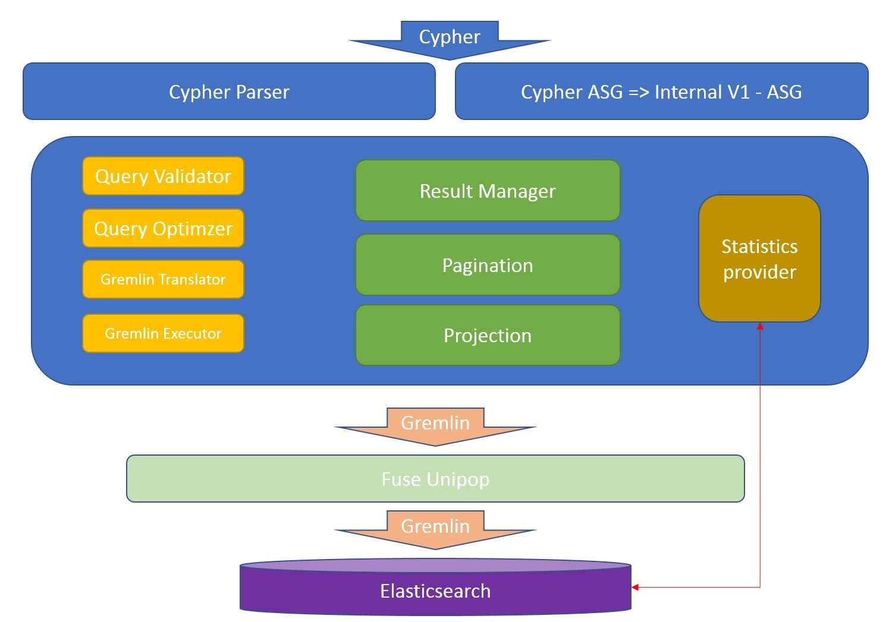
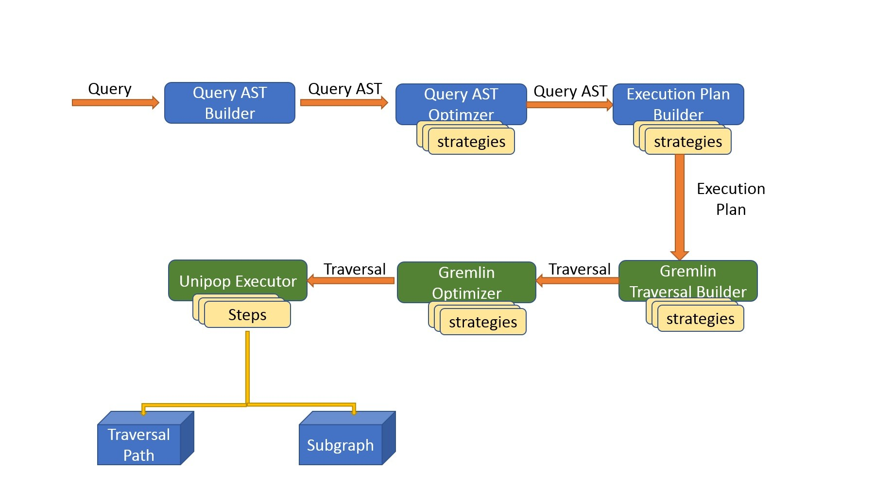
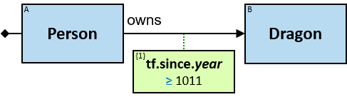
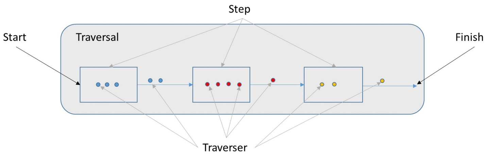
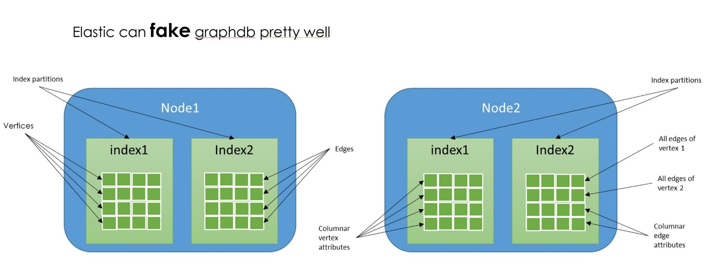

### Abstract
open-graph is a graph query engine. It is based on opensearch as the
physical graph storage layer and the tinkerpop graph traversing framework.

* ## Preference

The world of graph databases has had a tremendous impact during the last
few years, in particularity relating to social networks and their effect of our
everyday activity.

The once mighty (and lonely) RDBMS is now obliged to make room for an
emerging and increasingly important partner in the data center: the graph
database.

Twitter’s using it, Facebook’s using it, even online dating sites are using it;
they are using relationship-graphs. After all, social is social, and ultimately,
it’s all about relationships.

## Graph DB Features:

* Versatile Engine API including query cursor and paging
* Pattern based graph query language with cypher support
* Cost based optimizer to enable fast and efficient graph search
* Customized graph schema definition and enforcement
* Paging and customized Results Projection
* Highly scalable using opensearch robust scaling facilities
* Highly searchable using opensearch search abilities
* Extendable which allows customization in multiple features

## Highlight

open-graph was developed with an effort to allow very large-scale data
ingestion at a high rate. It was optimized to allow performance tuning for
different use cases.

It was taken into consideration that the data variety is vast and therefore the
graph physical model takes into consideration multiple schema constraints.

Utilizing **opensearch** both as an internal search engine and as graph
repository gives an improved performance and maintaining abilities.

Over opensearch’s API we developed a database with query engine,

optimized cost based execution planner and a traversing execution driver.

_We take pride in doing so with a small and excellent team of highly
innovative and creative engineers._

## Graph Query Process break down

The Process of transforming the Query into the physical layer traversal and
execution of the query is composed of the several phases, each has a
distinct purpose

* ASG – Abstract Syntax Graph (also known as Abstract Syntax Tree )
* EPB – (Logical) Execution Plan Builder
* GTA – Gremlin Traversal Appender (Physical Plan Builder)
* Executor – Executed the Physical Plan
* Results projector – Projects the results back to logical

### Graph Query Language

We are using a proprietary Graph traversal language called V

This is a logical high-level (property) graph query language which has an
emphasis on query patterns, and visual attributes.

### Execution Plan Building

**_Execution plan builder_** utilizes the strong statistics abilities of
elastcisearch indices and performs a nightly batch of statistics (histogram
and cardinality) calculations over the graph data elements so that each
execution plan will always choose the optimized ( time wise) plan.

### Traversing and data fetching

In this process we take the logical execution plan and translating it into a
physical plan - expressed in **unipop** language which is an extension of
the **Tinkerpop language**

This step allows us to describe the query as a set of generic low level graph
traversing instruction.

#### Step buffering

Buffering is a paging technic that allows each step to buffer results until a
certain size is reached before continuing to the next step.

In a step, having a filter can produce less results than the bulk size – due to
the input vertices being filtered out, In such cases we would like to continue
fetching results from the datastore until the bulk size is reached.

#### opensearch storage

opensearch stores the graph elements as documents while defining what type of graph element
the index will store.

Each index holds a single type of mapping (elastic 6) meaning vertices index will contain the
vertices documents with properties, the edges index will contain the edges documents with
properties.

A catalog of types to indices mapping is maintained and the mapping of properties to physical
types is also used to optimize pushdown of predicates to the DB search API itself.

