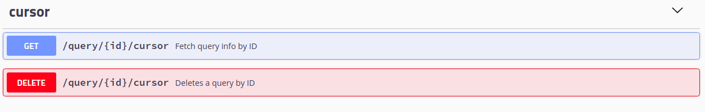

## Knowledge Assembly Flavor - API

### Swagger API
Once the engine has started - please open the swagger API page file 
   
    http://localhost:8888/swagger
    http://localhost:8888/redocly/redocly
    

OpenGraph has multiple API endpoints that serve different purposes:

### Management
Allows to query the version & configuration info.

Allows to initiate a DB sequencer used to generate unique ids to the newly generated graph elements. 

### Catalog
Allows insert & query information regarding the catalog & schema - ontology & indices.

The creation of logical ontologies inside the schema model is done here.

 * Supports GraphQL Definition language using: 

   
    [POST] http://localhost:8888/opengraph/catalog/grqphql

 * Supports OWL (Sparql) Definition language using: 

   
    [POST] http://localhost:8888/opengraph/catalog/sparql

 * Supports DQL (DDL) Definition language using: 

   
    [POST] http://localhost:8888/opengraph/catalog/sql

### Query

This is the main query API used to question the Data held by the engine. 

The API supports creating queries in the following languages:

* V1 query language (default language)
* Cypher query language 
* GraphQL language
* SparQL language
* SQL language

Each query (in any language) is verified and translated into intermediate language that is used to plan the actual traversal path.

Once a query was created, it needs to define a cursor resource - which is a view on the query results.

### Cursor - types
The cursor API is the resource which is responsible to fetch the actual data in bulks (pages) and project the results in the requested view.

 - Paths  (Assignments - view the data as a list of assignments)
 - Graph  (View the data as a subgraph)
 - Table  (View the data as a table)

Each of the cursors is the responsible for the data fetching, the page resource is the data holder .

### Plan

The plan API enables the user to understand the execution path taken for the query.

It is also possible to get the generated traversal used to traverse the data - tinkerpop graph traversal

### Page

The page holds the results in the projected pattern, each page holds a constant number of elements
When fetching the last page it can return a lower number or results or zero elements signaling all the elements
matching the query fetched pattern .

### Data

This is the actual data structure.

_nextPageData/_ API allows fetching the next page while allowing deletion of the former page is needed.

### GraphApi
This is the standard graph api that is used to ask a set of typical graph queries and operations against the DB

 - find path between vertices
 - get a specific vertex including its properties
 - get a specific vertex including its properties & neighbors
 

### Dashboard

This API allows viewing statistical information regarding the amount of graph elements, types and creation times

### Init

This API is used to generate the physical schema according to the index provider instruction used with the ontology
logical schema.

This API enables both the creation of the indices mapping templates as well as the actual indices.

### Load
This API is used for initialization of the indices according to the physical ontology;

- init will initialize the tables and tables templates
- drop will drop the tables
- load will load a logical graph model into the DB according to the logical ontology

### Upload

- upload will load a file/zipfile containing logical graph model into the DB according to the logical ontology

