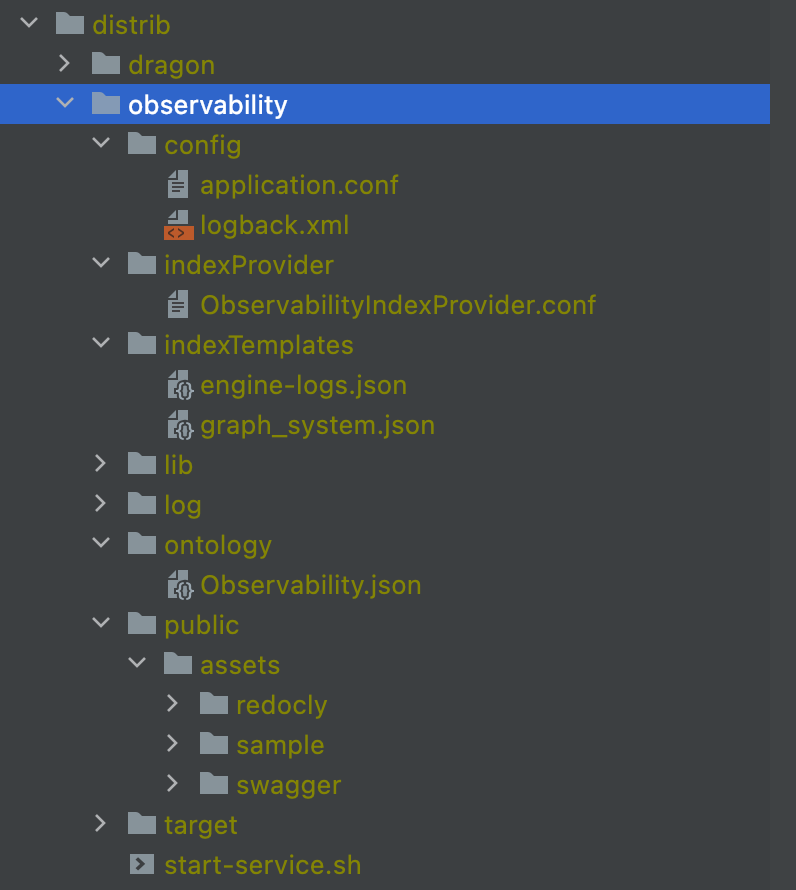

# Configuration

This document describes how the graph engine is configured, how different parts in the configuration folder effect the functionality.
It will also show examples for extending the existing (default) configuration and guide the process of extending
some basic functionality using the configuration.

## The configuration folder structure



The configuration folder is constructed from the next elements:

 - **Config** sub folder containing the application.conf file
 - **IndexProvider** sub folder containing the domain's physical schema index structure
 - **IndexTemplate** sub folder containing the system's log schema index structure
 - **Lib** sub folder containing all the jars needed for the application to run
 - **Log** sub folder containing the application's log files
 - **Ontology** sub folder containing the domain's logical schema - ontology 
 - **Public** web container sub folder containing web pages such as swagger and redocly

## Application config
The application's config file is the _**application.conf**_, it contains the next type of configurations:

* Application's name, host & port.

```text
application.env = engine2.m1.test
application.host = 0.0.0.0
application.port = 8888
```
* 
* Application profile to determine which modules to load
* Application' modules list to load:
  * Service modules
  * Core modules
  * Domain modules
  
```text
application.profile = activeProfile

modules.activeProfile = [
  "org.opensearch.graph.services.modules.ServiceModule",
  "org.opensearch.graph.services.modules.LoggingJacksonModule",
  "org.opensearch.graph.dispatcher.modules.CoreDispatcherModule",
  "org.opensearch.graph.dispatcher.query.graphql.GraphQLModule",


  "org.opensearch.graph.dispatcher.modules.DescriptorsModule",
  "org.opensearch.graph.asg.translator.graphql.AsgGraphQLModule",
  "org.opensearch.graph.asg.translator.cypher.AsgCypherModule",

  "org.opensearch.graph.asg.M2AsgModule",
  "org.opensearch.graph.epb.plan.modules.EpbDfsCountBasedRedundantModule",
  "org.opensearch.graph.asg.AsgValidationModule",
  "org.opensearch.graph.gta.module.GtaModule",
  "org.opensearch.graph.executor.ExecutorModule",
  "org.opensearch.graph.executor.modules.discrete.CursorsModule",
  "org.opensearch.graph.observability.ObservabilityModule"
]

```
_Modules are loaded using google's guice IOC container._

* Web container related configurations
```text
server.http.HeaderSize = 8k
# Max response buffer size
server.http.ResponseBufferSize = 10m
# Max request body size to keep in memory
server.http.RequestBufferSize = 10m
# Max request size total (body + header)
server.http.MaxRequestSize = 100m
```

* Opensearch's setting config - when running using opensearch embedded mode

```text
opensearch.embedded = ture
opensearch.delete_data_on_load = false
opensearch.hosts = [ "localhost" ]
opensearch.port = 9300
opensearch.cluster_name = Observability
opensearch.default_search_size = 10000000
opensearch.max_search_size = 1000000000
opensearch.scroll_size = 10000
opensearch.scroll_time = 600000

opensearch.cluster.routing.allocation.disk.watermark.low = 10gb
opensearch.cluster.routing.allocation.disk.watermark.high = 5gb
opensearch.cluster.routing.allocation.disk.watermark.flood_stage = 1gb
opensearch.cluster.info.update.interval = 10s

```

* Unipop traversing configuration 
```text
unipop.bulk.max = 1000
unipop.bulk.start = 1000
unipop.bulk.multiplier = 1
```

* The domain name 
```text
assembly = Observability
```

* Application configuration for specific modules (pluggable) 
  * Schema providers
  * ASG Strategy provider
  * Execution Plan provider
  * Ui-Graph provider

```text
Observability.stats_provider_class = org.opensearch.graph.epb.plan.statistics.NoStatsProvider

Observability.physical_schema_initiator = org.opensearch.graph.executor.ontology.schema.load.DefaultGraphInitiator
Observability.physical_schema_data_loader = org.opensearch.graph.executor.ontology.schema.load.IndexProviderBasedGraphLoader
Observability.physical_schema_csv_data_loader = org.opensearch.graph.executor.ontology.schema.load.IndexProviderBasedCSVLoader

Observability.plan_extension_strategy_class = org.opensearch.graph.epb.plan.extenders.M1.M1DfsRedundantPlanExtensionStrategy
Observability.physical_schema_provider_factory_class = org.opensearch.graph.executor.ontology.schema.GraphElementSchemaProviderJsonFactory
Observability.asg_strategy_registrar = org.opensearch.graph.asg.strategy.M2AsgStrategyRegistrar
Observability.physical_raw_schema = org.opensearch.graph.executor.ontology.schema.IndexProviderRawSchema
Observability.search_order_provider= org.opensearch.graph.unipop.controller.search.DefaultSearchOrderProvider
Observability.idGenerator_indexName = .idgenerator

Observability.unigraph_provider = org.opensearch.graph.executor.ontology.discrete.M1OpenSearchUniGraphProvider
Observability.cursor_factory = org.opensearch.graph.executor.cursor.discrete.TraversalCursorFactory

opengraph.node_status_reporter = org.opensearch.graph.executor.resource.PersistantNodeStatusResource
opengraph.plan_traversal_translator_class = org.opensearch.graph.gta.translation.discrete.M1PlanTraversalTranslator

```

* Application configuration location
* Application circuit - breaker timeout
```text
opengraph.ontology_provider_dir = ontology
opengraph.index_provider_dir = indexProvider
opengraph.timeout = 1800000

```