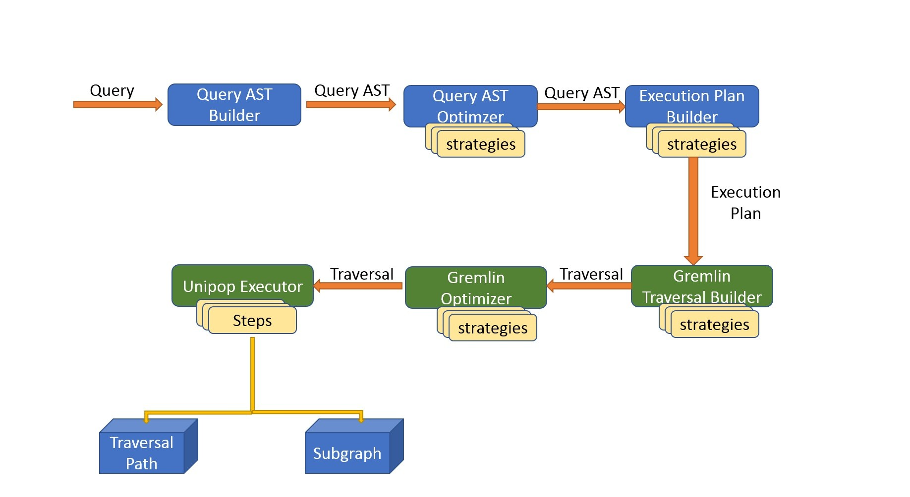

# Understanding the Query Flow 

This document explains and describes the end to end flow. It includes 
- a query is accepted from the user  
- query is translated and transformed 
- query is used to build an execution plan 
- plan is executed and results are returned 

These steps include the dispatch to the underlying database engine, and until the results are transformed and projected into the logical schematic 
structure and the specific query instructions (specific fields and aliases)

### Architecture - introduction

The project is a monolith composed of multiple modules (components)
The project uses Maven project build,management and dependency system.

There are **4 conceptual layers** of modules that the project is composed of:
- **Core layer** - which the main generic entities and models are defined
- **Virtual layer** - which the specific functionality implementing and extending the core layer
- **Service layer** - which compose these two layers and defines the **Model View Control** access to the API
- **Domain layer** -  which contains the domain specific modules including specific configuration and add-ons

For additional details please visit [architecture](../Architecture.md)

### Graph Runner - 

The graph runner is a component that resides on the service layer. It's main class is [GraphRunner](../../../opengraph-services/src/main/java/org/opensearch/graph/services/GraphRunner.java) 

It is responsible for the following parts:

 - reading the configuration files [Configuration Folder](../../../opengraph-services/src/test/conf) 
 - Starting the Jooby Web server [Jooby Web Server](https://github.com/jooby-project/jooby)

Another essential component is the [GraphApp](../../../opengraph-services/src/main/java/org/opensearch/graph/services/GraphApp.java)
This component is responsible for connecting the web container lifecycle to the Graph Engine's and registering the Http Endpoints
with the containers so that it will expose them externally.

### API - introduction

Once the Graph Engine is loaded and started it exposes the next HTTP endpoints (using jooby as the web server container)

 - Management API
 - Catalog API
 - Query API
 - Graph API
 - Dashboard API

In general this API is following the [REST](https://en.wikipedia.org/wiki/Representational_state_transfer) convention for Resources

For this document we will focus on the Query API, additional information can be found under [API](Api.md)

#### Query Resource - RESTFULL API

The Main resources that compose the core of the query process :

 - **Query**
   - **Cursor**
     - **Page**
       - **Data**

 This hierarchy structure allows the interaction with the server in the following way:
 
 1) A user sends a POST request to a Query url: http://localhost/opengraph/query/

  Once the request has arrived it is sent to the query controller for further processing:
    1.1) Query Resource (with auto generated ID) is created
    1.2) Cursor Resource (with auto generated ID) is created : http://localhost/opengraph/query/{queryID}/cursor
    1.3) Page Resource (with auto generated ID) is created : http://localhost/opengraph/query/{queryID}/cursor/{cursorID}/page
    1.4) Data Resource (with auto generated ID) is created : http://localhost/opengraph/query/{queryID}/cursor/{cursorID}/page/{pageId}/Data

We can observe that the query is actually a container for the cursors resources, the cursor is a container for the page resources and the page is a container for the resulting data.
More on this structure and interaction later...
 
#### Query API
The Query API has multiple endpoints for sending a query - they differ in
 - Query language Type
 - Query response type returned (Data / Cursor / Future)

The software component responsible for receiving the Http request and initiating the flow is the [QueryController](../../../opengraph-services/src/main/java/org/opensearch/graph/services/controllers/QueryController.java)

In order to inform the web container of the supported endpoints - it must be registered under the Registration mechanism mentioned above [GraphApp](../../../opengraph-services/src/main/java/org/opensearch/graph/services/GraphApp.java)
Basically all the controllers which want to execute some logic when an HTTP request arrive must be registered in a similar manner. 

Specifically **_QueryController_** interface is implemented by the Standard Query Controller which implements all the required functionality [StandardQueryController](../../../opengraph-services/src/main/java/org/opensearch/graph/services/controllers/StandardQueryController.java) 

All the basic (default) controllers are implemented in the service module, if we want to extend them - it is done by adding a domain specific module and
registering this module within the configuration file - for additional info on configuration please visit [Configuration](Configuration.md)

#### Query Driver
In this architecture, each controller is coupled with a matching driver which is responsible for the actual details of the task it is given.

  - Query Controller <--> Query Driver
  - Cursor Controller <--> Cursor Driver
  - Page Controller <--> Page Driver

In our example the responsibility of the StandardQueryController is to dispatch the request to the driver and once the driver returns a result to return this result to the calling endpoint.

The Query Driver [QueryDriver](../../../opengraph-core/src/main/java/org/opensearch/graph/dispatcher/driver/QueryDriverBase.java) is actually not part of the Service layer but it's a core component and therefor is residing in the core layer.
Same as in the controller case, the Query Driver is an interface which is implemented by the Base Driver shown above.

**_note_** 
To allow maximal capability for extension and openness for new capabilities, the **_QueryDriverBase_** is an abstract class, which has a specific implementation in the Virtual Layer.
This specific implementation [StandardQueryDriver](../../../virtualize/virtual-core/src/main/java/org/opensearch/graph/core/driver/StandardQueryDriver.java) may not necessarily add new functionality but dictates the responsibility of
the virtual layer to be the actual implementation which is driving the execution.

#### Query Driver 

Once the query driver accepts the textual query from the http request it starts the next chain of events

1) Create the actual Query Entity from the given string body parameter
  1.1) This creation is done using the Abstract Syntax Graph module
  1.2) It first validates the query
  1.3) It then creates a Query Objects model
  1.4) And last it applies different rules and optimizations to simplify and compact the query model.
 
  More on the Abstract Syntax Graph module please view [ASG](ASG-AbstractSyntaxGraph.md)

2) After the Query object was created, the next step is to create the Query resource representation of it in the memory
   This allows the resources to be persisted and fetched if needed using an auto generated ID. 

#### Cursor Driver

After the Query resource was stored in memory, the next phase is to create the cursor entity.
The cursor represents an instance of an execution of query against the underlying database in a specific point in time.

A query may have multiple cursors representing multiple points in time the query was executed against the database.

Currently, the next cursors type are supported: 
 
 - Graph Cursor
 - Table Cursor
 - Traversal Cursor
 - Count Cursor
 - Projection Cursor

More on this topic please view [Cursor](Cursor.md)

A cursor is created in the Base Cursor Driver [Cursor Driver](../../../opengraph-core/src/main/java/org/opensearch/graph/dispatcher/driver/QueryDriverBase.java)
The Base Cursor driver is an abstract class in the Core Layer - it is actually being used by the Virtual Layer by the extending Standard Page Driver class (similar to the Standard Cursor Driver)

#### Page Driver

In a similar way to the operation of the cursor driver, the page driver is responsible for both populating its results from the databse using
the Cursor's _**getNextResults**_ method.

In addition, once the results are populated, it stores the data into memory and saves the Page as a RESTFULL resource so that it may be fetched directly.

