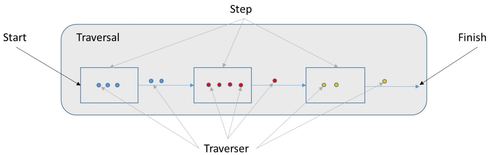

# Unipop Step Controller flow
Each UniStep has the following features:
 
 - It is derived from UniBulkStep
 - It has an accompanied strategy class derived from [AbstractTraversalStrategy]()
 - It contains controllers to fetch data from the search engine

## UniGraphStep

Lets see for example the [UniGraphVertexStep](../../../unipop-core/src/main/java/org/unipop/process/vertex/UniGraphVertexStep.java)
We can observe both the step and the step-strategy.

Every UniBulkStep implements a **_process_** method which does the actual graph traversing for that specific step.

It is using a [BulkIterator](../../../unipop-core/src/main/java/org/unipop/process/bulk/BulkIterator.java) to iterate over the results from the previous step, pushes them down to the search engine
according to its own predicate and constraints and finally returns the result for the next step to continue and processing.

The actual search against the engine that is happening in the **_process_** method is using a [SearchVertexQuery](../../../unipop-core/src/main/java/org/unipop/query/search/SearchVertexQuery.java) object.
This object is created in the **_process_** method and transferred to the controller that is responsible for the execution. 

```java
      SearchVertexQuery vertexQuery = new SearchVertexQuery(Edge.class, uniqueVertices, direction, predicates, -1, propertyKeys, null, context, stepDescriptor);
      Iterator<Traverser.Admin<E>> traversersIterator = Stream.ofAll(this.controllers)
                .map(controller -> controller.search(vertexQuery))
                .flatMap(iterator -> () -> iterator)
                .flatMap(edge -> toTraversers(edge, idToTraverser))
                .iterator();
```

## Controller
The controller is deriving from [SearchVertexQuery](../../../unipop-core/src/main/java/org/unipop/query/search/SearchVertexQuery.java) and has a concrete
Component [VertexControllerBase](../../../virtualize/virtual-unipop/src/main/java/org/opensearch/graph/unipop/controller/common/VertexControllerBase.java) which contains all the search-engine-driver access functionality.

The _**search(SearchVertexQuery searchVertexQuery)**_ method does all the following steps - 

 - create query context
 - translates the gremlin step using search [Appenders](../../../virtualize/virtual-unipop/src/main/java/org/opensearch/graph/unipop/controller/promise/appender) into SearchBuilder
 - builds a DSL query using the searchBuilder 
 - [SearchHitScrollIterable](../../../virtualize/virtual-unipop/src/main/java/org/opensearch/graph/unipop/converter/SearchHitScrollIterable.java) is created and given the searchRequest to execute
 - each result if than converted from the search results format into UniStep vertex or edge [converter](../../../virtualize/virtual-unipop/src/main/java/org/opensearch/graph/unipop/controller/discrete/converter/DiscreteVertexConverter.java)


The next image shows the Step-Traverser-Traversal relationship
