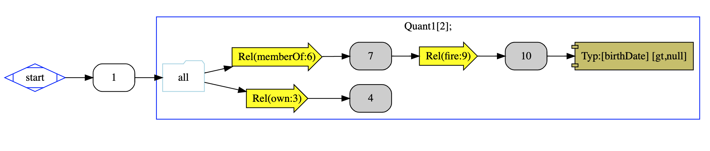
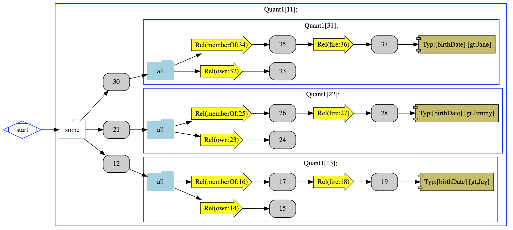

# Parameterized Constraints
The notion of parameterized constraint is created so that a query can become a template for asking similar questions while
allowing the user to specify different scope to the question by submitting different values to the query each time it performs. 

### Example
Let's consider the next example:
```text
└── Start, 
    ──Typ[:Person P1#1]──Q[2:all]:{3|6}, 
                                   └-> Rel(:own null#3)──Typ[:Dragon V1#4], 
                                   └-> Rel(:memberOf null#6)──Typ[:Dragon E2#7]--> Rel(:fire null#9)──Typ[:Horse V2#10]──?[11]:[birthDate<gt,null>]]
```

Parameterized Query:



Parameterized Query After being resolved with set of params ```{"Jay", "Jimmy", "Jane"}```:

