# Opensearch Graph Roadmap
This document represents the roadmap for integrating and developing graph capabilities and features on top of opensearch using opensearch graph.

## Introduction
 - Opensearch-Graph is based on opensearch as the physical graph storage layer and the tinkerpop graph traversing framework.

 - Opensearch-Graph enables executing (visual) graph queries against any set of opensearch indices and projecting the results.

**Including**

### Physical Ontology Support
Enabling  optimized data layer, support both labeled property graph with schema enforcement and RDF - model for dynamic schema structure
### Logical Ontology Support

Knowledge Graph enabled, support runtime ontology assembly that allows multi-tenant and data projection according to the query context.
### Cypher language Support
Supports cypher query usage as a fully featured endpoint query engine.

### GraphQL Support
Supports schematic and query usage as a fully featured graphQL query engine.

### Advanced Search capabilities
All Supported opensearch & lucene search capabilities & analyzers:
Ngram, fuzzy search, GeoSpacial, terms, time-series, ranking, most significant, TF-IDF …

### Cost Based Optimizer
Based on the opensearch’s cardinality and count estimation for documents representing graph elements, an optimal execution plan is build and performed.
Using sketches for stochastic streaming algorithms that predict cardinality over disconnected databases.

### Unipop 
A Gremlin fork over opensearch is used to graph-traverse in one of the largest operational cluster in the world – over 500 Data nodes (IDF Intelligence agency)

### Matured And performant Execution Architecture
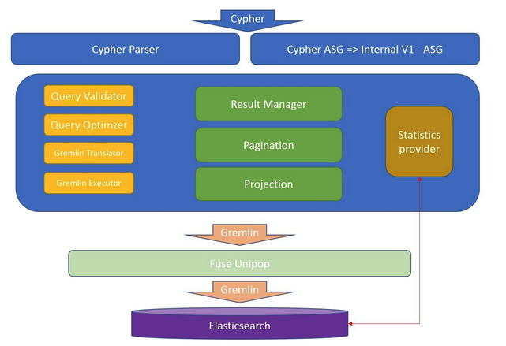

As true for so many databases, opensearch-graph follows the common practices of the fields:

From parsing the query to an abstract syntax tree during which validations and logical schema query rewrites are preformed, moving on to a dynamic algorithm for Cost Based Optimizer for selecting the most efficient execution plan over the data,
using stochastic sketches to materialize efficient statistical information such as cardinality and quantiles.
All these and many more will ensure that the sophisticated and well-structured codebase will take advantage of the most modern and reliable techniques and algorithms to promise the best performance available.

### Open Architecture – build for scalability and extensibility
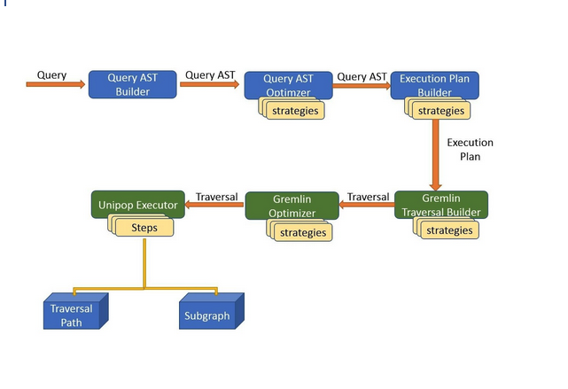
Built with openness and extensibility in mind, opensearch-graph offers a configurable layered architecture that allows plugin and replace almost any part of the execution chain.
Using a modern IOC container with a supervised module system which allows high level of control over execution and behavior.

------------------------------------------------------------------------------------------------

------------------------------------------------------------------------------------------------

## The Knowledge Plane
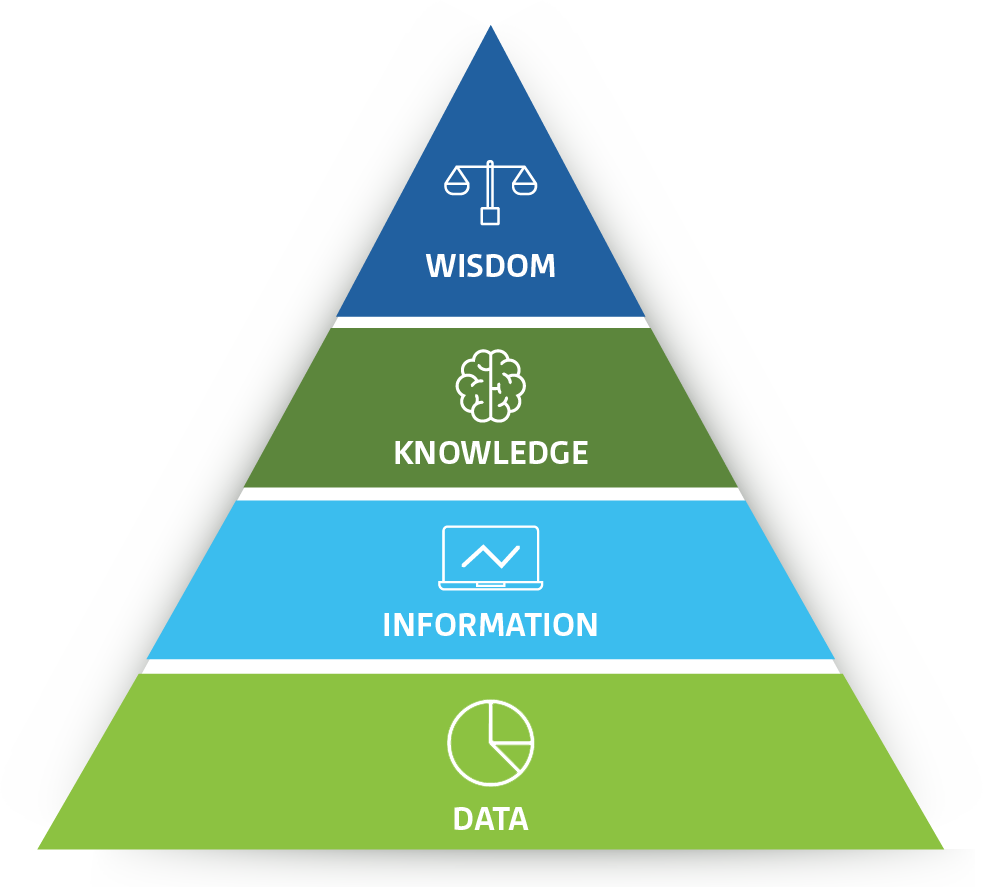

The existing **control** plane and **data** plane are the traditional elements which allow to store, manage and retrieve the data.
They are in daily use and help the customers to govern and use their data.
In most cases - the data plane gives a superficial projection of the real knowledge of data:
 - Only query the exact format that was ingested 
 - Unstructured data can be utilized only for very naive use-cases
 - Rules and Alerts needs to be manages and examined out of scope
 - Fusion/Correlation of similar data concerns need to be done out of scope
 - Anomaly detections and data quality measurements is also done out of scope

With all these important and common use cases out of scope for both the manage and data plane - the creation of a knowledge plane is necessary evolution.

The **Knowledge Plan** is an abstract level that is residing on top of the data and management plans. This plane is responsible for
 1) **Using an Ontology to Describe & Understanding the customer data**
 2) **Infer schema from unstructured data according to context**
 3) **Fuse & correlate ingested data into meaningful insights** 
 4) **Allow creations of SLO/KPI to measure the data & service quality**
 5) **Automatically identify anomalies on the flowing data stream**

These capabilities will be an integrative part of the knowledge plane - allowing the customer to interact with the logical
level of its domain entities and be unaware of the hidden complexities of the ingestion tier and the physical structure.

**_Main Components of the Knowledge Plan_**

### Knowledge Schema

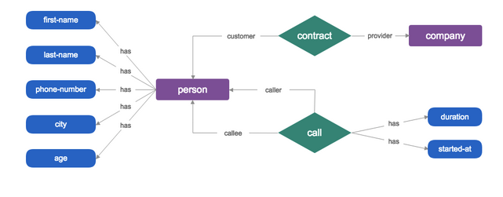

An intuitive & expressive data schema, with constructs to define hierarchies, entities, relations and rules, to build rich knowledge models.
The schema provides model type inheritance into the knowledge model. Following the object-oriented principle allows entities to inherit the behavior and properties of their parent.

- Managing taxonomy
- Explore the domain metadata 
- Hidden Relationships Discovery

### Logical Domain Query language 
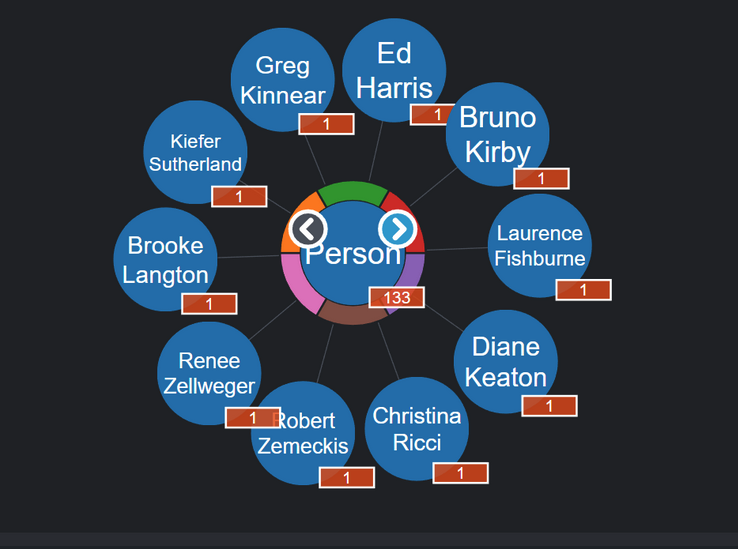
The query language allows simple and direct expression of the logical concerns involved in the search. 
The query language grammar and operators are driven towards reflecting the domain taxonomy with a clear understanding that
many performance and optimization concerns are ignored for this reason (these are pushed down to the engine to auto-optimize).

### Domain Specific Visualization - UX Widget
Visualize the specific user-domain in his own symbols and specific infographic depiction.
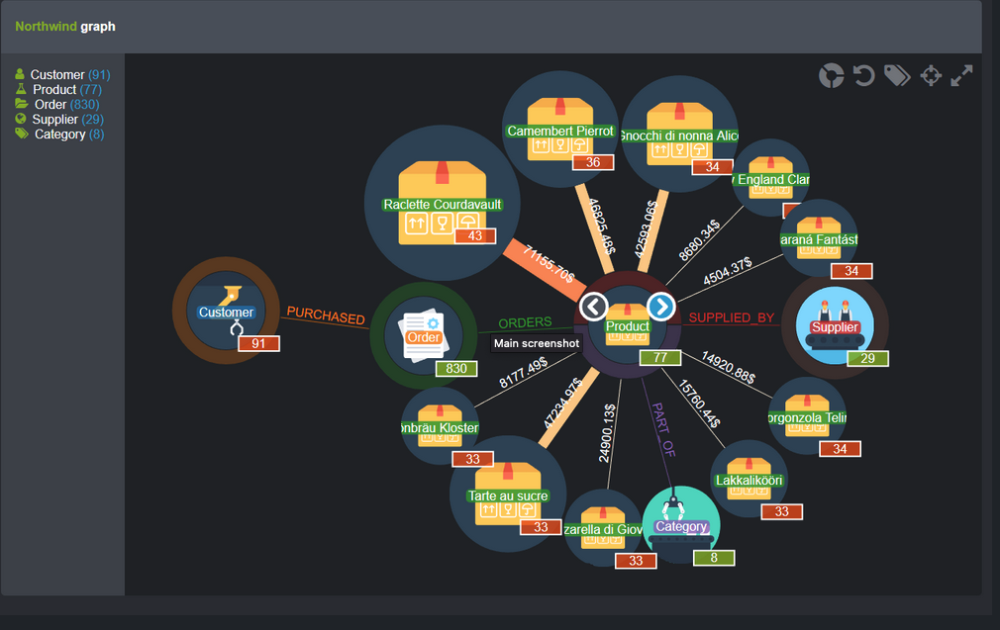
Such user experience driven capability that reflects the inherited graph nature of the domain will simplify and allow better usage of the engine capabilities.
The non-expert customer will be given a first-hand experience with graph based queries, which will allow him to easily translate his verbal queries.

### Results visualization and exploration - UX Widget
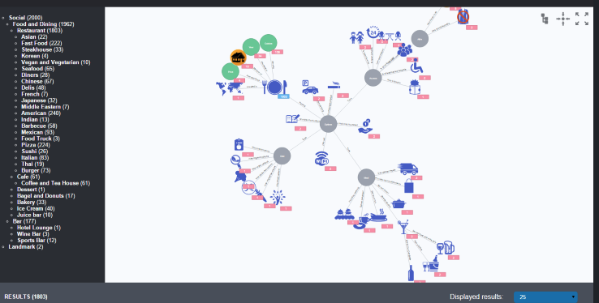
The same concept with the queries' visualization will be reflected in the results' visualization. Users will visually be able to explore and understand in the most immediate manner
the actual logical domain structure and relationship.

The results will also allow interactive exploration of the domain entities by continuing the traversing of the presented entities using a graph explorer.
The results' visualization will also allow to create faceting filtering on top of the presented entities to further dice and intersect the data.

### Catalog Insight
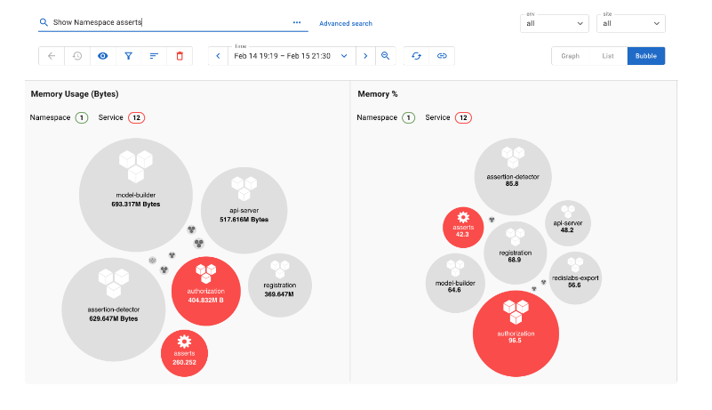

The catalog insight component will allow to observe the different domain-metadata entities and relationships composition and display insightful information on top 
of the metadata exploration.

Such insight information includes:
 - Amount of elements of each type
 - Amount of relations between different domain elements and their variance
 - Variance of elements with respect to top common categories (such as geography variance in person's place of birth field)
 - Time-line describing the ingestion time for each selected domain entity
 - Histogram scale for categorical related measurements such as connectivity between similar entities groups  
 - Histogram scale for long tail related measurements such as graph entity's degree
 - Cloud heat map of major centrality components

### Assets Discovery & Catalog Services 
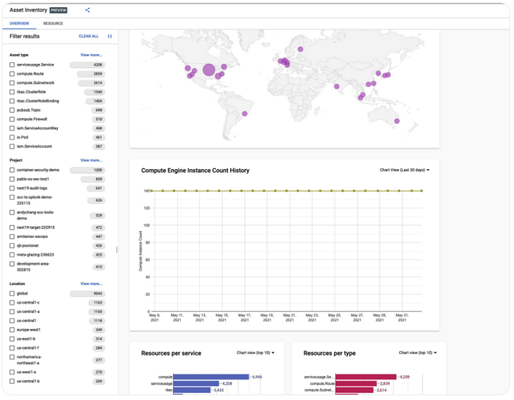

The Knowledge plane will auto describe and build the catalog resources that compose the customer's entire assets

**_Let's consider the observability knowledge domain - our main assets categories will compose of something like:_**

- Physical based components  
- Cloud based components  
- Service based components  
- Software based components  

This phase is done using the ingested logs data and being able to analyze the logs structure and content and populate the discovery matrix.
This discovery panel will also be time aware - it will be able to present the timely evolution of the customer's resources and see how specific
categories of elements have changed over time.

### PKI and SLO/SLA 

Defining and governance for desired behavior is a crucial feature of modern systems.
Both data quality and functioning operations are a mandatory requirement from almost every data-monitoring & observability system.  

**_Let's consider the observability knowledge domain - our SLO / SLA / PKI will be composed of the following:_**

SLOs are meant to capture high-level business objectives and help reduce alerts. We need easily define SLO and to provide automatic tracking of the SLO, and reports each violation on the Incidents page.

#### What do we want to measure and observer
 - **Requests** is about rate, latency, and error. Each Anomaly is verified with a range of standard deviation and percentage deviation.
 - **Resource** section is about CPU, Memory, Disk, Network, 

Resources like disk have I/O rate ps metrics (bytes read/write), so we have the ability to track anomalies with respect to these measurements.

**Health observation** is mostly about all the failure incidents in various domains - organize the domain rules by groups and within each group, the user can edit each individual rule.
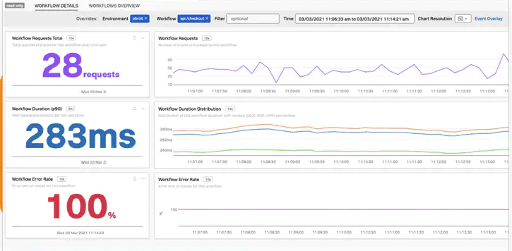

### Incident Managements / Research
Once a violation of SLO or some alert rule was fired - they will both be present in the Incident management panel.
The incident panel will allow to further investigate and drill down into the incident and verify what is the root cause.

**These include**:
 - Log-Level research   - start from a single error / alert log 
 - Trace-Level research - start from a trace that is indicated as anomaly 
 - SLO research         - start from a mis-behaving service / resource

Each of these research entry point will have the capability to drill down (into specific log or resource)
or zoom out from a single log to its containing span, initiating service/host and ect. 

Graph query capability will also be available here to further investigate.

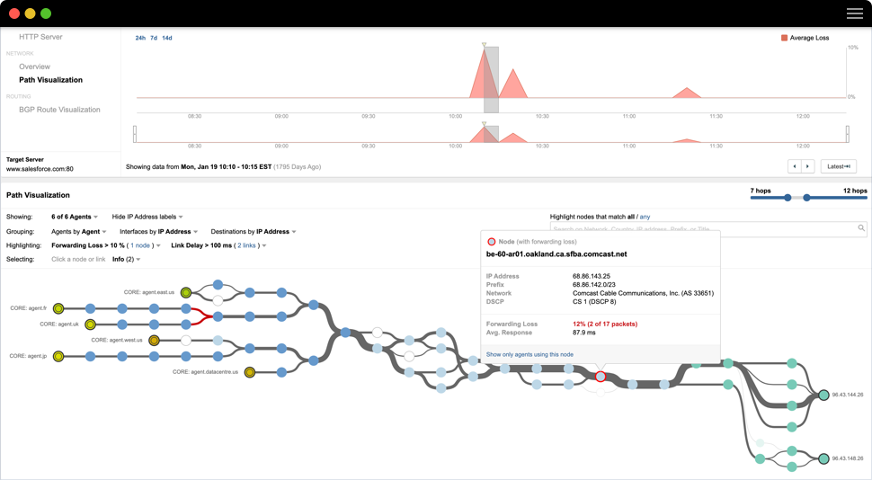

### ML/AI Insight
**Knowledge Graph Neural Networks  -** 

This is a novel variant of graph convolution, building upon the latest research.
KGCNs make use of all the available information a knowledge graph holds: node types, edge types, node features and structure.
As they do so, they utilize logical reasoning to also find inferred information of these types.

**KGCNs** (future planned support)
KGCNs provide users with a method of building a vector representation for any concept held in their knowledge graph. A vector representation should encapsulate its part in the graph both locally and globally - In this way, it can usefully be passed onwards to a domain-specific learning pipeline.

This makes learning pipelines much simpler.

Start by querying for the concepts to use as the training/validation/test/prediction knowledge-sets.
These queries can be as complex as necessary and will return the matching concepts, which can be passed to the KGCN in order to build an embedding for each of them.

We retrieve the data concerning this neighborhood , this information includes the type hierarchy, attribute value of each neighboring and any inferred neighbors (represented above by dotted lines).
This data is compiled into arrays to be ingested by a neural network.
Via operations Aggregate and Combine, a single vector representation is built for a Thing. This process can be chained recursively over K hops of neighboring Things.
This builds a representation for a Thing of interest that contains information extracted from a wide context.
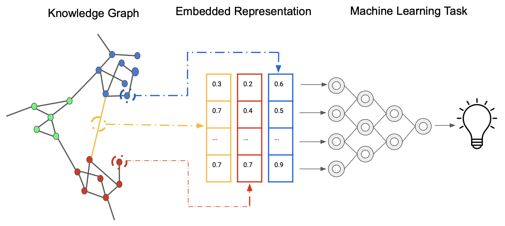

**NLP API support** - (future planned support)

The identification and further analysis of these explicit concepts and relationships help in discovering multiple insights contained in text in a scalable and efficient way.

Some of the various text-mining/NLP techniques include; structure extraction, tokenization, acronym normalization, lemmatization, de-compounding, and identifying language, sentences, entities, relations, phrases and paragraph …

Thanks to NLP, we have raw text mined data, and we can move onto data modelling.

To this end, we utilize the entity-relationship model to group each concept into either an entity, attribute, or relationship.
This means that all we have to do is to map each concept to a schema concept type, and recognize the relations between them.

In order to start modelling our NLP output, we first need to know what it actually looks like. The most basic mining extracts sentences from a body of text.
Those sentences have a sentiment, tokens (which make up the sentence), and relations between certain tokens. We also get a confidence measure of each type that the tool identifies.

The structure of our output is already graph-like. Traditional methods strive to encapsulate this rich information into tables, however that strips away a whole dimension of information and is counter-productive.

keeping this graph-like structure to build an integrated complex knowledge graph of everything we have extracted from the text corpus.
Discovering insights refers to finding new data that may be valuable to what we are trying to accomplish. In order to do that, we need to first look or ask for something. 

In other words, we start with a question. These questions can range from asking within the text, or even more complex ones regarding other data which is augmented by the text mined output.

**Data Fusion** 

See [Ingestion Normalization](IngestionNormalization.md)

**Data Correlation** 

**_Let's consider the observability knowledge domain - we can offer the following correlations:_**

**1. Correlate Metrics**

Metrics can be correlated by their abnormal behavior. If two metrics are independent, the probability that they will have overlapping anomalies gets lower. Therefore two or more metrics that have abnormal similarity, are often correlated by the occurrence of a particular incident.

**2. Correlate Logs**

Logs are normally long semi-structured strings. These are generally machine, app or service generated. More or less every log generated has a timestamp associated with it. Hence, the time-based semi-structural nature of logs make them a good candidate for pattern matching and correlation.

**3. Correlate Logs to Metrics**

Logs to Metrics correlation are useful to link between a logged incident and a set of recorded metrics. This correlation can be made based of time-stamp when the log was generated and looking at metric anomalies that happened during the same time-stamp window.

**4. Correlate Logs and Traces**

The connection between log and traces can be made by adding trace id, environment, service and version values in logs. Thereby making it easier to link already structured traces and semi-structured logs.

