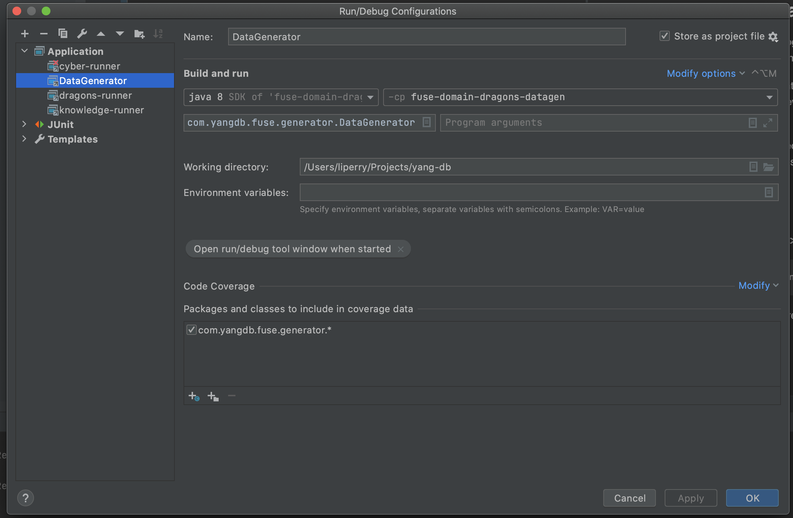
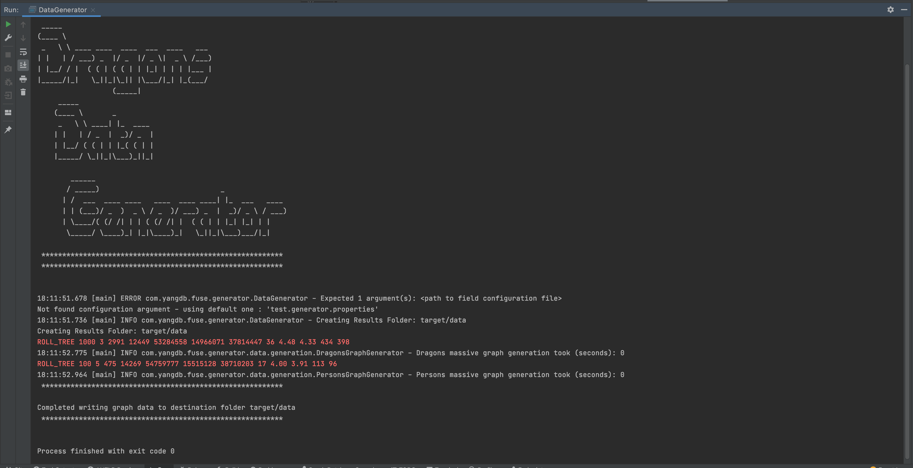
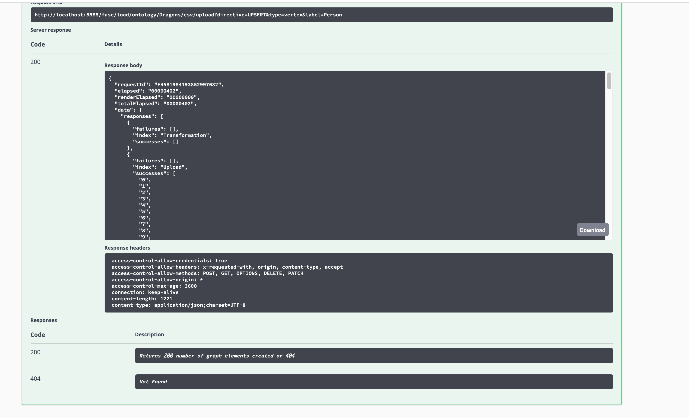

## Loading Sample Data
So we've completed installing the ontology and generating the physical elasticsearch schema (see create-ontology tutorial)
And now we would like to load some data.

Since this ontology is the base demo ontology we have prepared a data generator to create volumes of data to load and review many of the
features that are available in OpenGraph.

This tutorial already comes with prepared csv data files but one can use the next generation tool to create a configurable scale-free graph to verify and investigate
on his own

### Data Generator Tool
To activate the data generation tool we can call the next main class 
    
    org.opensearch.graph.generator.DataGenerator

Using the IntelliJ IDE one can run the prepared run-configuration :

This data generator uses graph scale configuration for the data creation:

    test.generator.properties
The configuration file give the user the ability to config volume and data distribution:
    
    
    #Persons
    person.knowProbability=0.7
    person.numberOfNodes=100
    person.edgesPerNode=5
    person.idPrefix = p
    person.heightMean=176
    person.heightSD=7
    person.maxChildren=7
    person.maxGuildMembership=10
    person.lifeExpectancyMean=80
    person.lifeExpectancySD=15
    person.meanDragonsPerPerson=10.0
    person.sdDragonsPerPerson=2.0
    person.meanHorsesPerPerson=10.0
    person.sdHorsesPerPerson=2.0
    #01/01/1900 Epoch Time
    person.startDateOfStory=-2208988800000
    #01/01/2000 Epoch Time
    person.endDateOfStory=946684800000
    person.personsResultsCsvFileName=personsTEST.csv
    person.personsRelationsCsvFileName=personsRelationsTEST.csv
    ...    
For example the Person entity data generation will be configured using the next attributes

The outcome of the generator is a list of csv files each representing either the entity or the relation:

    personsRelationsTEST.csv
    personsRelationsTEST_KNOWS.csv
    personsRelationsTEST_OWNS_DRAGON.csv
    personsRelationsTEST_OWNS_HORSE.csv
    personsRelationsTEST_scaleFreeSummary.txt

The next files represent the person entity and its different type of relations and a summary file containing the statistics and data distribution.

Running the data generator looks as follows:

### Loading CSV files
We will use the swagger REST API to load the csv files http://localhost:8888/swagger#/operations/load/post_load_ontology__id__csv_load 

Once the file is loaded it will be added to the appropriate table/s & the REST API will respond with the 
success status of the amount of entities uploaded to the store.

We will repeat this process with all the relevant entities / relationships of the Dragons ontology so that the graph would be populated and
we would be able to ask interesting graph queries upon the data.

**Note**: A zipped file can also be used in this API for much larger volumes of data.

---

#### Amounts
Once all csv file are loaded here are the expected document amount:
 
    - Dragon: 1000
    - Perosn:  100
    - Guild:    15
    - Horse:   500
    - Kindgom:   9
    
    - Fire:     45,500
    - Freeze:   20,000
    - Knows:      1742
    - MemberOf:   1862
    - SubjectOf:   282
    - RegisteredIn: 42 
    - OriginatedIn: 4250

### What's Next
For the most exciting part - in the next tutorial we will query the graph data using cypher query language

    
