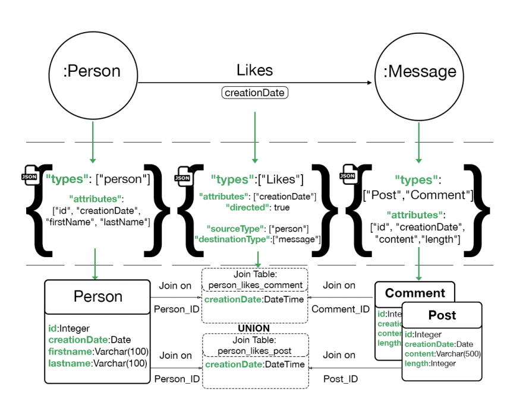
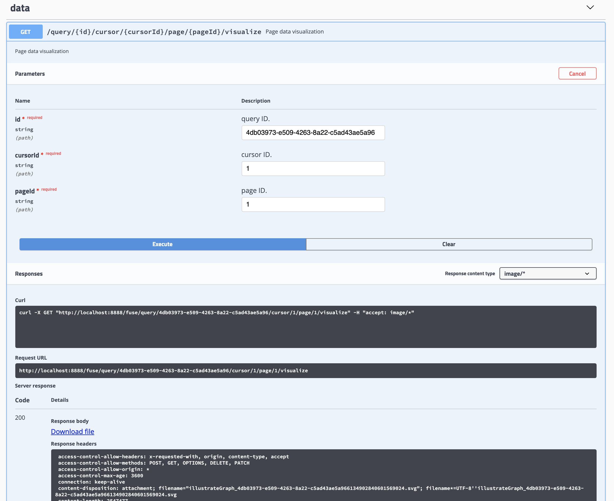
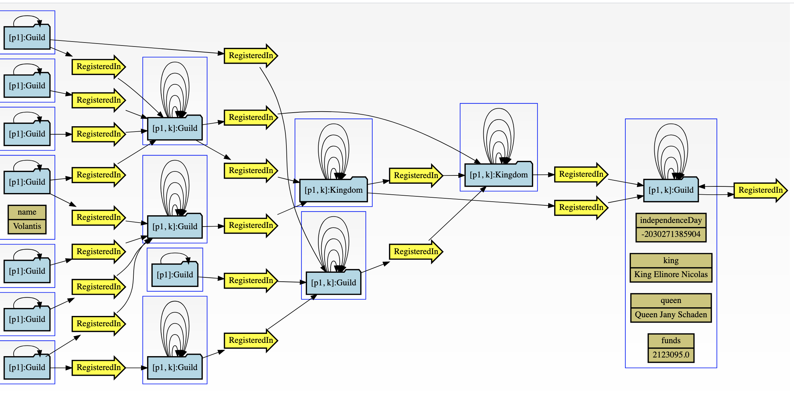
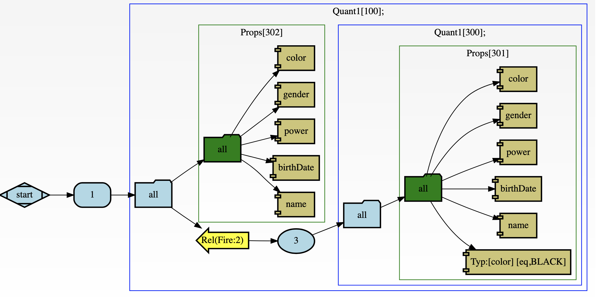

## Query the Data
During the last tutorial we've uploaded the Dragon's CSV ontology using the dedicated API and now we are ready to ask the
graph questions we've been waiting for.

### Graph Query Language
For a general purpose query to return the data we are looking for we need a language that can express the logical relations between the 
entities and relationships. The SQL language does support this type of relational algebra, but it is very difficult to express an expression that has
few "hops" of relationships in a regular SQL statement.

On top of that, the SQL statements are strictly bound to the physical store layer (tables) and we cant easily abstract that layer in a logical form.

The purpose of the graph language was to ease these exact hard constraints and to allow a more free (logical) language the has no explicit instruction of the way the algebric relation
should be resolved (Join in SQL) and all the patterns are present in a logical format.

In the next image we can visualize the simple cypher pattern
    
    (person)->[likes]- (message) 

versus the composite and large explicit SQL equivalent query:



If you need additional information regarding the cyper query language please review
the following :
 
 - https://neo4j.com/developer/cypher/ 
 - https://neo4j.com/blog/open-cypher-sql-for-graphs/

### Let's start asking questions
First I would like to see some Dragons in the graph, I will use the REST API for sending the appropriate cypher query

#### Query:1

     Match (d:Dragon) return *

As shown we need to populate the size of the page being fetched (OpenGraph supports pagination), the name of the ontology and the query


After the server completes the execution it returns the following results:
    
```
{
  "requestId": "FR581995536421289984",
  "elapsed": "00001367",
  "renderElapsed": "00000081",
  "totalElapsed": "00001448",
  "data": {
    "resourceUrl": "http://20.10.10.104:8888/fuse/query/4db03973-e509-4263-8a22-c5ad43ae5a96",
    "resourceId": "4db03973-e509-4263-8a22-c5ad43ae5a96",
    "cursorStoreUrl": "http://20.10.10.104:8888/fuse/query/4db03973-e509-4263-8a22-c5ad43ae5a96/cursor/1/page",
    "explainPlanUrl": "http://20.10.10.104:8888/fuse/query/4db03973-e509-4263-8a22-c5ad43ae5a96/plan",
    "v1QueryUrl": "http://20.10.10.104:8888/fuse/query/4db03973-e509-4263-8a22-c5ad43ae5a96/v1",
    "asgUrl": "http://20.10.10.104:8888/fuse/query/4db03973-e509-4263-8a22-c5ad43ae5a96/asg",
    "elasticQueryUrl": "http://20.10.10.104:8888/fuse/query/4db03973-e509-4263-8a22-c5ad43ae5a96/elastic",
    "type": "concrete",
    "error": null,
    "innerUrlResourceInfos": [],
    "cursorResourceInfos": [
      {
        "resourceUrl": "http://20.10.10.104:8888/fuse/query/4db03973-e509-4263-8a22-c5ad43ae5a96/cursor/1",
        "resourceId": "1",
        "error": null,
        "cursorRequest": {
          "maxExecutionTime": 600000,
          "profile": false,
          "cursorType": "LogicalGraphCursorRequest",
          "ontology": "Dragons",
          "createPageRequest": {
            "pageSize": 100,
            "fetch": false
          },
          "include": "all",
          "format": "JSON"
        },
        "pageStoreUrl": "http://20.10.10.104:8888/fuse/query/4db03973-e509-4263-8a22-c5ad43ae5a96/cursor/1/page",
        "pageResourceInfos": [
          {
            "resourceUrl": "http://20.10.10.104:8888/fuse/query/4db03973-e509-4263-8a22-c5ad43ae5a96/cursor/1/page/1",
            "resourceId": "1",
            "executionTime": 0,
            "dataUrl": "http://20.10.10.104:8888/fuse/query/4db03973-e509-4263-8a22-c5ad43ae5a96/cursor/1/page/1/data",
            "requestedPageSize": 100,
            "actualPageSize": 1,
            "data": {
              "pattern": {
                "ont": "Dragons",
                "name": "4db03973-e509-4263-8a22-c5ad43ae5a96"
              },
              "assignments": [...],
              "resultType": "assignments"
            },
            "elasticQueryUrl": "http://20.10.10.104:8888/fuse/query/4db03973-e509-4263-8a22-c5ad43ae5a96/cursor/1/page/1/elastic",
            "available": true
          }
        ]
      }
    ]
  }
}
```        

This is the general response of the OpenGraph query API, it contains the following elements:

#### Query Resource 
 - request ID
 - execution time
 - request store url (all queries are stored)
 - cursor resource

#### Cursor Resource 
The cursor resource is the actual container in which the data is fetched and paged, a query may have multiple cursores where each cursor
represents a point in time (data snapshot) where the query took place and its relevant results.

 - cursor ID
 - cursor url (all resources are stored)
 - cursor type ( projection result type)
 - cursor format (Json / CSV / ...)
 - page resource

#### Page Resource 
The page results contain the pages that represent the data patterns that returned from the engine, the pages contain the data 

- page ID
- page url (all resources are stored)
- page size
- pattern (the query itself)
- data 

#### Visualize the Results 
Since all the results actually reside inside the page resource we can access the ext REST API to visualize a page result using
the query Id, Cursor Id and the Page Id 



### Find Me a Friend
Now I would like to see some People knowing other people in the graph, again I will use the REST API for sending the appropriate cypher query

    Match (p1:Person)-[know:Know]-(p2:Person) return *

This time I would like the other side of the relation people to female -

#### Query:2
```
    Match (p1:Person)-[know:Know]-(p2:Person {gender: FEMALE}) return *
```

Lets visualize the results:


#### Query:3
This time lets see Guilds registered in kingdoms that have a positive cache flow...
```
    Match (p1:Guild)-[r:RegisteredIn]-(k:Kingdom)  where k.funds > 0 return *
```

Lets visualize the results:


#### Query:4
This time lets see Guilds registered in kingdoms that have a positive cache flow...
```
    Match (p1:Guild)-[r:RegisteredIn]-(k:Kingdom)  where k.funds > 0 return *
```

#### Query:5
Now lets see the exciting Dragons battles ... give us the dragons who fire upon black dragons
```
    Match (d:Dragon)-[f:Fire]-(d1:Dragon) where d1.color = BLACK return *
```


As same as before we visualize the results or we can even visualize the actual intermediate query that the engine has generated to fetch the data
we will use the nest REST API to visualize the AST (Abstract Syntax Tree) that was created:

http://localhost:8888/swagger#/operations/query/get_query__id__asg_visualize



#### Query:6
Now lets see this complex query:

A (female) person that owns a black dragon, that black dragon fired upon another male dragon;
The female person also owns a horse that is originated from a kingdom that has a positive funds...


```
    Match (p:Person {gender:FEMALE})-[o:Own]-(d:Dragon {color :BLACK}),
            (p:Person)-[oh:Own]-(h:Horse),
            (d:Dragon)-[f:Fire]-(other:Dragon { gender:MALE}),
            (h:Horse)-[org:OriginatedIn]->(k:Kingdom )
     where k.funds > 0  return *
```

**The ASG query looks as follows:**


#### Query:6
**Lets aggregate some data:**

If we want to filter out nodes according to their edge count we will use the following semantics:
```
Match (p1:Person)-[o:Own]-(d1:Dragon) WHERE count(o) > 50 return *
```
When we use the aggregate function count with the tag as operand the engine will create a push-down of a pipe term aggregation...

This will result in the Person node that fulfill the edge count filter condition.

It is very much possible to combine the aggregative filter with row based filter such as the following query:

```
Match (p1:Person)-[o:Own]-(d1:Dragon) WHERE count(o) > 50 AND d1.color = BLACK  return *
```


We can also use the **distinct** keyword to dedup the edges between nodes - meaning that in the following example only one fire edge will be returned
for every pair of dragons - if a dragon fired multiple times only one edge will be returned... 
```
Match (d1:Dragon)-[f:Fire]->(d2:Dragon)  return d1, distinct(f), d2
```

### What's Next
For the next part - in the next tutorial we will review different type of cursors that enable us to materialize queries and count results


